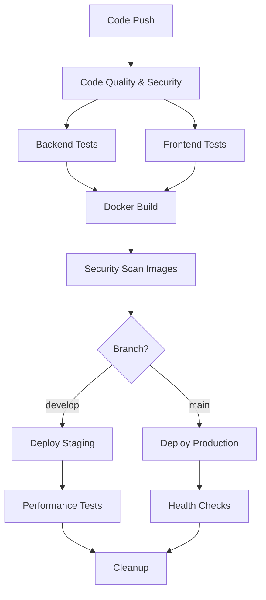

# CarRental SaaS - CI/CD Pipeline Guide

Esta guía documenta el pipeline CI/CD enterprise para CarRental SaaS con GitHub Actions.

## 📋 Tabla de Contenidos

- [Arquitectura del Pipeline](#arquitectura-del-pipeline)
- [Workflows Disponibles](#workflows-disponibles)
- [Configuración Inicial](#configuración-inicial)
- [Variables de Entorno](#variables-de-entorno)
- [Secrets Requeridos](#secrets-requeridos)
- [Estrategia de Branching](#estrategia-de-branching)
- [Deployment Automático](#deployment-automático)
- [Monitoreo y Alertas](#monitoreo-y-alertas)

## 🏗️ Arquitectura del Pipeline

### Pipeline Principal: `ci-cd-enterprise.yml`



### Etapas del Pipeline

| Etapa | Descripción | Duración Aprox. |
|-------|-------------|-----------------|
| 🔍 Code Quality | Análisis estático, seguridad | 3-5 min |
| 🔧 Backend Tests | Unit + Integration tests | 5-8 min |
| ⚛️ Frontend Tests | Unit + Component tests | 3-5 min |
| 🐳 Docker Build | Multi-arch image builds | 8-12 min |
| 🛡️ Security Scan | Container vulnerability scan | 2-3 min |
| 🚀 Deploy Staging | Automatic on develop | 2-5 min |
| 🌟 Deploy Production | Manual/automatic on main | 3-8 min |

## 🔄 Workflows Disponibles

### 1. CI/CD Principal
- **Archivo**: `.github/workflows/ci-cd-enterprise.yml`
- **Triggers**: Push a main/develop, PRs, releases
- **Funciones**: Testing completo, builds, deployments

### 2. Dependabot Auto-merge
- **Archivo**: `.github/workflows/dependabot-auto-merge.yml`
- **Triggers**: PRs de Dependabot
- **Funciones**: Auto-merge de actualizaciones menores

### 3. Dependency Updates
- **Archivo**: `.github/dependabot.yml`
- **Triggers**: Scheduled (Lunes/Martes)
- **Funciones**: Actualizaciones automáticas de dependencias

## ⚙️ Configuración Inicial

### 1. Repository Settings

```bash
# Enable GitHub Actions
Settings → Actions → General → Allow all actions

# Configure environments
Settings → Environments → Create:
- staging (with protection rules)
- production (with protection rules and required reviewers)
```

### 2. Branch Protection

```yaml
# .github/branch-protection.yml
main:
  required_status_checks:
    - "Code Quality & Security"
    - "Backend Tests"
    - "Frontend Tests"
  require_code_owner_reviews: true
  required_approving_review_count: 2

develop:
  required_status_checks:
    - "Code Quality & Security"
    - "Backend Tests"
    - "Frontend Tests"
```

### 3. CODEOWNERS

```bash
# .github/CODEOWNERS
* @carrental-team
*.yml @devops-team
docker-compose*.yml @devops-team
Dockerfile* @devops-team
```

## 🔐 Variables de Entorno

### Repository Variables

```bash
# Settings → Secrets and variables → Actions → Variables
REGISTRY_URL=ghcr.io
JAVA_VERSION=17
NODE_VERSION=20
SONAR_PROJECT_KEY=carrental-saas
```

### Environment Variables (Staging)

```bash
API_BASE_URL=https://staging-api.carrental.com
FRONTEND_URL=https://staging.carrental.com
DATABASE_URL=postgresql://staging-db:5432/carrental
```

### Environment Variables (Production)

```bash
API_BASE_URL=https://api.carrental.com
FRONTEND_URL=https://carrental.com
DATABASE_URL=postgresql://prod-db:5432/carrental
```

## 🔑 Secrets Requeridos

### Repository Secrets

```bash
# Container Registry
GHCR_USERNAME=github-username
GHCR_TOKEN=ghp_xxxxxxxxxxxxx

# SonarCloud (opcional)
SONAR_TOKEN=squ_xxxxxxxxxxxxx

# Codecov (opcional)
CODECOV_TOKEN=xxxxxxxxxxxxx

# Notifications
SLACK_WEBHOOK_URL=https://hooks.slack.com/services/xxx
TEAMS_WEBHOOK_URL=https://outlook.office.com/webhook/xxx
```

### Staging Environment Secrets

```bash
DB_PASSWORD=staging_secure_password
JWT_SECRET=staging_jwt_secret_key
STRIPE_SECRET_KEY=sk_test_xxxxxxxxxxxxx
SMTP_PASSWORD=staging_smtp_password
```

### Production Environment Secrets

```bash
DB_PASSWORD=production_ultra_secure_password
JWT_SECRET=production_jwt_secret_key_256_bits
STRIPE_SECRET_KEY=sk_live_xxxxxxxxxxxxx
SMTP_PASSWORD=production_smtp_password
MONITORING_API_KEY=prod_monitoring_key
```

## 🌿 Estrategia de Branching

### Git Flow Simplificado

```bash
main        # Production releases
  ├── develop    # Integration branch
  ├── feature/*  # Feature branches
  ├── hotfix/*   # Production hotfixes
  └── release/*  # Release preparation
```

### Workflow de Desarrollo

1. **Feature Development**
   ```bash
   git checkout develop
   git checkout -b feature/nueva-funcionalidad
   # ... desarrollo
   git push origin feature/nueva-funcionalidad
   # Create PR to develop
   ```

2. **Release Process**
   ```bash
   git checkout -b release/v2.1.0
   # ... preparación de release
   git checkout main
   git merge release/v2.1.0
   git tag v2.1.0
   git push origin main --tags
   ```

3. **Hotfix Process**
   ```bash
   git checkout main
   git checkout -b hotfix/critical-fix
   # ... fix
   git checkout main
   git merge hotfix/critical-fix
   git checkout develop
   git merge hotfix/critical-fix
   ```

## 🚀 Deployment Automático

### Triggers de Deployment

| Evento | Entorno | Descripción |
|--------|---------|-------------|
| Push a `develop` | Staging | Deployment automático |
| Push a `main` | Production | Deployment automático* |
| Release creado | Production | Deployment automático |
| Manual trigger | Staging/Prod | Via GitHub UI |

*Requiere approval en production environment

### Proceso de Deployment

#### Staging Deployment
```yaml
1. Build y push de imágenes Docker
2. Security scan de contenedores
3. Deploy a staging environment
4. Smoke tests automáticos
5. Performance tests (opcional)
6. Notificación a Slack/Teams
```

#### Production Deployment
```yaml
1. Approval requerido (2 reviewers)
2. Deploy con rolling update
3. Health checks post-deployment
4. Smoke tests en producción
5. Rollback automático si falla
6. Notificación a todos los canales
```

### Rollback Strategy

```bash
# Rollback automático
if health_checks_fail; then
  kubectl rollout undo deployment/carrental-backend
  kubectl rollout undo deployment/carrental-frontend
  notify_team "🔄 Automatic rollback executed"
fi

# Rollback manual
git revert HEAD
git push origin main  # Triggers new deployment
```

## 📊 Monitoreo y Alertas

### Métricas del Pipeline

- **Success Rate**: > 95%
- **Build Time**: < 15 minutos
- **Deploy Time**: < 5 minutos
- **Test Coverage**: > 80%

### Alertas Configuradas

```yaml
Pipeline Failures:
  - Slack: #devops-alerts
  - Email: devops@carrental.com
  - PagerDuty: Critical failures

Security Issues:
  - Slack: #security-alerts
  - Email: security@carrental.com
  - Block deployment automáticamente

Performance Degradation:
  - Slack: #performance-alerts
  - Create Jira ticket automáticamente
```

### Dashboards

- **GitHub Actions**: Workflow runs y métricas
- **Codecov**: Test coverage trends
- **SonarCloud**: Code quality metrics
- **Container Registry**: Image vulnerability reports

## 🔧 Troubleshooting

### Problemas Comunes

#### 1. Build Failures

```bash
# Cache issues
Actions → Caches → Delete all caches

# Permission issues
Settings → Actions → General → Workflow permissions: Read and write

# Resource limits
Upgrade to GitHub Teams/Enterprise for more minutes
```

#### 2. Test Failures

```bash
# Flaky tests
Increase timeouts en test configuration
Add retry logic para tests inestables

# Environment issues
Verificar services en workflow (postgres, redis)
Verificar variables de entorno en tests
```

#### 3. Deployment Failures

```bash
# Image pull errors
Verificar GHCR_TOKEN permissions
Re-authenticate container registry

# Environment connectivity
Verificar network security groups
Verificar DNS resolution
```

### Debug del Pipeline

```bash
# Enable debug logging
Settings → Secrets → Actions → Add:
ACTIONS_STEP_DEBUG = true
ACTIONS_RUNNER_DEBUG = true

# Local testing con act
npm install -g @nektos/act
act -j backend-tests --secret-file .secrets
```

## 📈 Optimizaciones

### Performance Improvements

1. **Cache Optimization**
   - Maven dependencies cache
   - Node modules cache
   - Docker layer cache

2. **Parallel Execution**
   - Backend y Frontend tests en paralelo
   - Multi-arch builds en paralelo
   - Security scans en paralelo

3. **Resource Management**
   - Use GitHub-hosted runners para builds
   - Self-hosted runners para deployments
   - Spot instances para performance tests

### Cost Optimization

```yaml
# Resource limits
jobs:
  build:
    runs-on: ubuntu-latest-4-cores  # Para builds pesados
    timeout-minutes: 30  # Evitar loops infinitos

# Conditional execution
if: github.event_name != 'pull_request' || contains(github.event.pull_request.labels.*.name, 'full-ci')
```

## 🔄 Maintenance

### Updates Semanales

- Revisar Dependabot PRs
- Actualizar action versions
- Revisar security alerts
- Optimizar performance del pipeline

### Updates Mensuales

- Revisar métricas del pipeline
- Actualizar documentación
- Revisar y optimizar workflows
- Training del equipo en nuevas features

---

## 📞 Soporte

Para soporte del CI/CD:

- **Slack**: #devops-support
- **Email**: devops@carrental.com
- **Jira**: DevOps board
- **Confluence**: Pipeline documentation

### Escalation

1. **L1**: DevOps team (response: 30 min)
2. **L2**: Platform team (response: 2 hours)
3. **L3**: Architecture team (response: 4 hours)